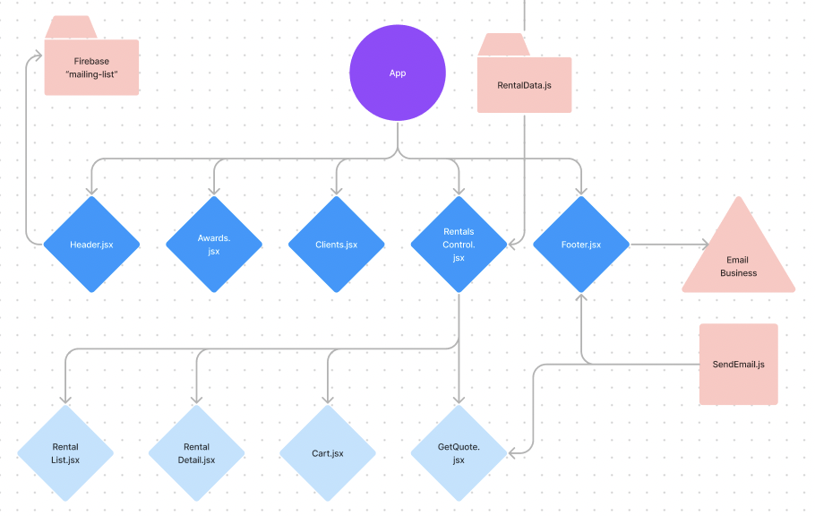

# Cams Cameras

#### By Robert Bryan, Mauro Rosales, & Kirsten Opstad

#### A React app for a Camera Rental house
***

*Stock image of coffee beans, courtesy [ShareGrid](https://unsplash.com/@sharegrid) via [Unsplash](https://unsplash.com/).*
***

## Description

Cam's Camera is a camera rental house providing service to customers by offering high-quality camera rentals by the week. This small business eCommerce site uses quote-to-invoice payment model faciliated by autogenerated emails.

***
## Technologies Used

* React
* Next.js
* JavaScript
* Bootstrap
* HTML
* CSS
* webpack
* Node.js
* EmailJS

***

### Objectives (MVP)

__User Stories:__

<!-- ✅ -->

* As a user, I want to:
  * ✅ Look at equipment available for rent
  * ✅ Description of each item
    * Weekly Base Price
    * Photos - different angles
  * ✅ Create quote cart
    * ✅ Add items to quote cart
    * ✅ View List of items added to quote cart
    * Increment item in quote cart
    * Decrement item in quote cart
    * Empty quote cart

  * ✅ Get Quote for order
    *  ✅ Price:
      * ✅ Per Item for duration
      * ✅ Whole Total
      * ✅ Determines rental period in weeks based on user input
      * ✅ Calculates itemized weekly subtotals based on unique item prices
      * ✅ Adds shipping cost if rental requires delivery

  * Sign up for Newsletter

  * Check reviews/testimonials - awards 

### __Further Exploration (Stretch Goals)__

  * Add lookup by Invoice #
  * Checkout with invoice / order number
  * Implement late fees / short lead time
  
***
## Process 

### Component Drawing


***
## Implementation
1. ✅ Build component drawing
2. ✅ Establish Component Hierarchy
3. ✅ Build Static Components
4. ✅ Add State
5. ✅ Add Firebase / Firestore
6. Create Mockup
7. Style to Match Mockup
8. Deploy

***
## Goals
1. Meet MVP
2. Stretch: 
3. Stretch: 

***
## Setup/Installation Requirements
This is a [Next.js](https://nextjs.org/) project bootstrapped with [`create-next-app`](https://github.com/vercel/next.js/tree/canary/packages/create-next-app).

## Getting Started

### From Next.js:

First, run the development server:

```bash
npm run dev
# or
yarn dev
# or
pnpm dev
```

Open [http://localhost:3000](http://localhost:3000) with your browser to see the result.

You can start editing the page by modifying `pages/index.js`. The page auto-updates as you edit the file.

[API routes](https://nextjs.org/docs/api-routes/introduction) can be accessed on [http://localhost:3000/api/hello](http://localhost:3000/api/hello). This endpoint can be edited in `pages/api/hello.js`.

The `pages/api` directory is mapped to `/api/*`. Files in this directory are treated as [API routes](https://nextjs.org/docs/api-routes/introduction) instead of React pages.

This project uses [`next/font`](https://nextjs.org/docs/basic-features/font-optimization) to automatically optimize and load Inter, a custom Google Font.

## Learn More

To learn more about Next.js, take a look at the following resources:

- [Next.js Documentation](https://nextjs.org/docs) - learn about Next.js features and API.
- [Learn Next.js](https://nextjs.org/learn) - an interactive Next.js tutorial.

You can check out [the Next.js GitHub repository](https://github.com/vercel/next.js/) - your feedback and contributions are welcome!

## Deploy on Vercel

The easiest way to deploy your Next.js app is to use the [Vercel Platform](https://vercel.com/new?utm_medium=default-template&filter=next.js&utm_source=create-next-app&utm_campaign=create-next-app-readme) from the creators of Next.js.

Check out our [Next.js deployment documentation](https://nextjs.org/docs/deployment) for more details.
<!-- 
* Clone this repo to your workspace.
* Navigate to the top level of the directory.
* In the root directory of the project, run this command to install all packages listed in the package.json:
```
$ npm install
```
* Then, to build and serve the project, run: 
```
$ npm run start
``` -->
***
## Known Bugs

* No known bugs. If you find one, please email me at kirsten.opstad@gmail.com with the subject **[_Repo Name_] Bug** and include:
  * BUG: _A brief description of the bug_
  * FIX: _Suggestion for solution (if you have one!)_
  * If you'd like to be credited, please also include your **_github user profile link_**

***
## License

MIT License

Copyright (c) 2023 Robert Bryan, Mauro Rosales, & Kirsten Opstad

Permission is hereby granted, free of charge, to any person obtaining a copy of this software and associated documentation files (the "Software"), to deal in the Software without restriction, including without limitation the rights to use, copy, modify, merge, publish, distribute, sublicense, and/or sell copies of the Software, and to permit persons to whom the Software is furnished to do so, subject to the following conditions:

The above copyright notice and this permission notice shall be included in all copies or substantial portions of the Software.

THE SOFTWARE IS PROVIDED "AS IS", WITHOUT WARRANTY OF ANY KIND, EXPRESS OR IMPLIED, INCLUDING BUT NOT LIMITED TO THE WARRANTIES OF MERCHANTABILITY, FITNESS FOR A PARTICULAR PURPOSE AND NONINFRINGEMENT. IN NO EVENT SHALL THE AUTHORS OR COPYRIGHT HOLDERS BE LIABLE FOR ANY CLAIM, DAMAGES OR OTHER LIABILITY, WHETHER IN AN ACTION OF CONTRACT, TORT OR OTHERWISE, ARISING FROM, OUT OF OR IN CONNECTION WITH THE SOFTWARE OR THE USE OR OTHER DEALINGS IN THE SOFTWARE.
