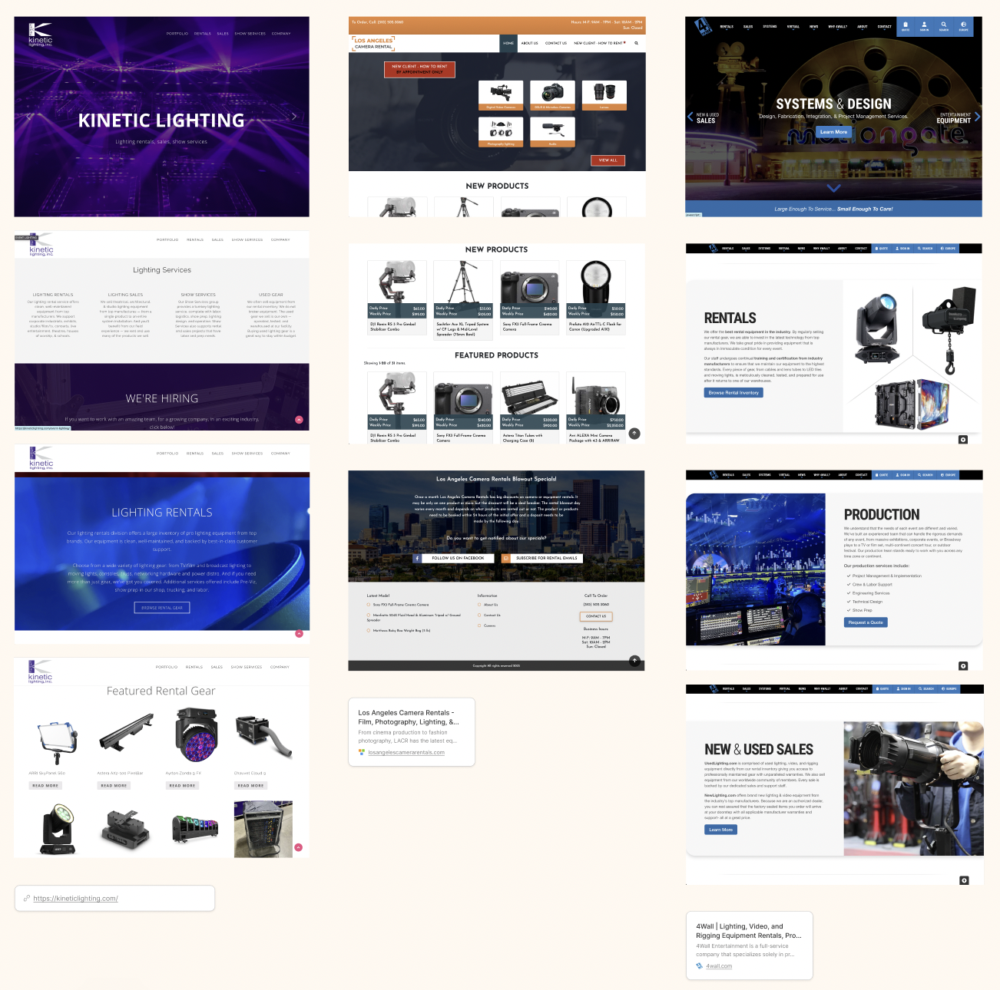
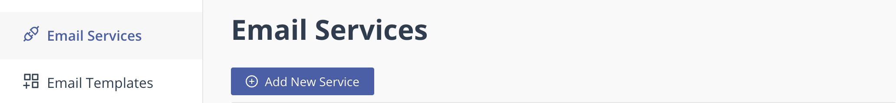
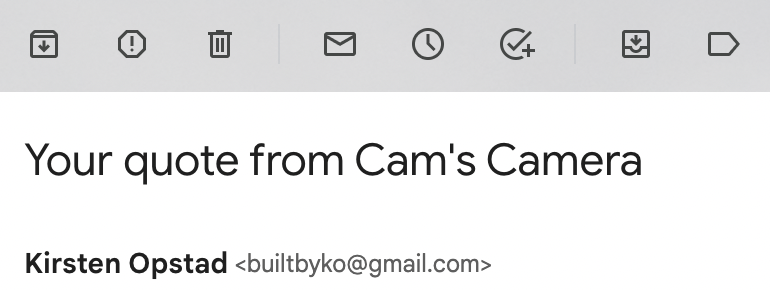
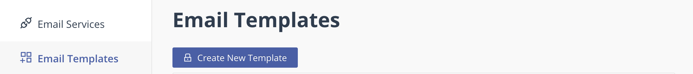
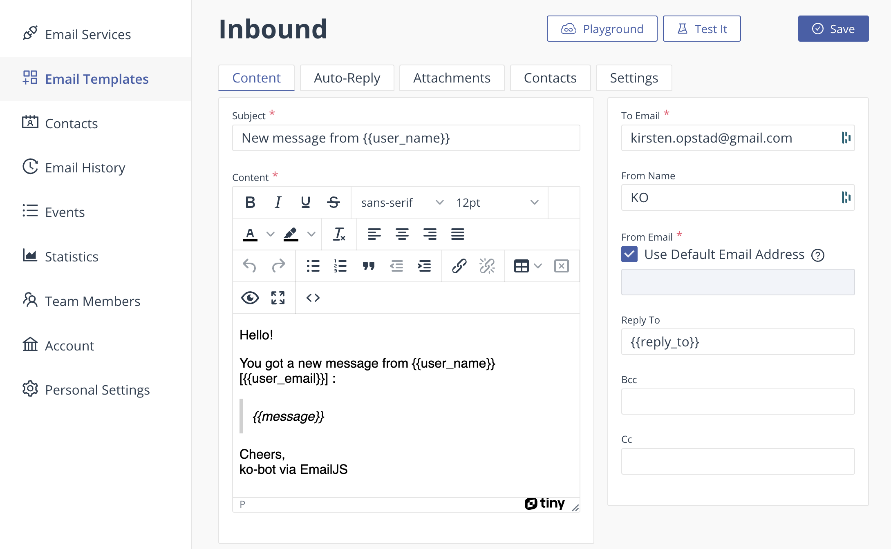
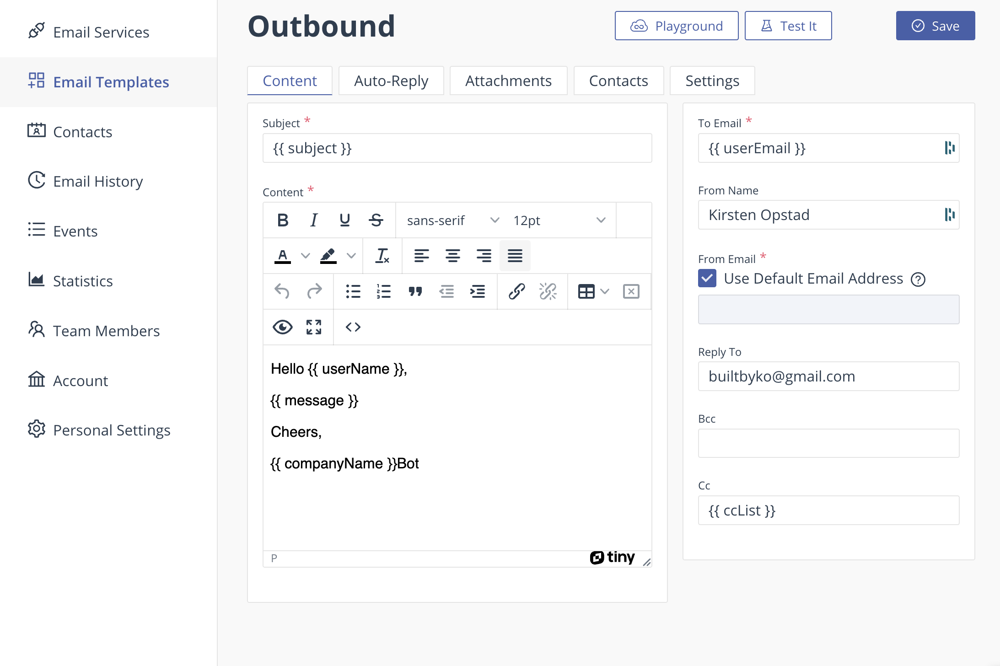
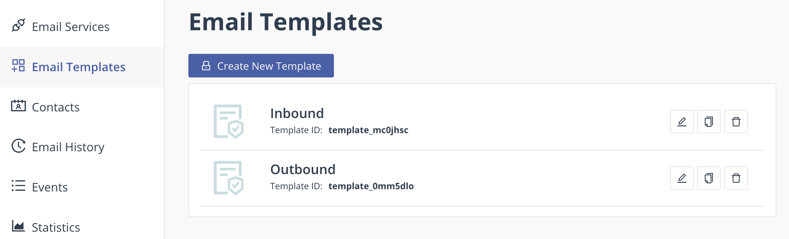

# Cams Cameras

#### By [Robert Bryan](https://github.com/robbryandev), [Mauro Rosales](https://github.com/maurorosalesjr), & [Kirsten Opstad](https://github.com/kirstenopstad)

#### A React app for a Camera Rental house
***

*Stock image of Canon DSLR, courtesy [ShareGrid](https://unsplash.com/@sharegrid) via [Unsplash](https://unsplash.com/).*
***

## Description

Cam's Camera is a camera rental house providing service to customers by offering high-quality camera rentals by the week. This small business eCommerce site uses quote-to-invoice payment model faciliated by autogenerated emails.

***
## Technologies Used

* React
* Next.js
* JavaScript
* Bootstrap
* HTML
* CSS
* webpack
* Node.js
* EmailJS

***

### Objectives (MVP)

__User Stories:__

<!-- ✅ -->

* As a user, I want to:
  * ✅ Look at equipment available for rent
  * ✅ Description of each item
    * ✅ Weekly Base Price
    * ✅ Photos - different angles

  * ✅ Create quote cart
    * ✅ Add items to quote cart
    * ✅ View List of items added to quote cart
    * ✅ Increment item in quote cart
    * ✅ Decrement item in quote cart
    * ✅ Empty quote cart

  * ✅ Get Quote for order
    *  ✅ Price:
      * ✅ Per Item for duration
      * ✅ Whole Total
      * ✅ Determines rental period in weeks based on user input
      * ✅ Calculates itemized weekly subtotals based on unique item prices
      * ✅ Adds shipping cost if rental requires delivery

  * ✅ Sign up for Newsletter

  * ✅ Check reviews/testimonials - awards 

### __Further Exploration (Stretch Goals)__

  * Checkout with invoice / order number
  * Implement late fees / short lead time
  
***
## Process 

### Component Drawing


### Design Research


### Mockup


***
## Implementation
1. ✅ Build component drawing
2. ✅ Establish Component Hierarchy
3. ✅ Build Static Components
4. ✅ Add State
5. ✅ Add Firebase / Firestore
6. ✅ Create Mockup
7. ✅ Style to Match Mockup
8. Deploy

***
## Goals
1.  ✅ Meet MVP
2. Stretch: Checkout with invoice / order number
3. Stretch: Save quotes & reviews to firebase

***
## Setup/Installation Requirements
This is a [Next.js](https://nextjs.org/) project bootstrapped with [`create-next-app`](https://github.com/vercel/next.js/tree/canary/packages/create-next-app).

### Getting Started


* Clone this repo to your workspace.
* Navigate to the top level of the directory.
* In the root directory of the project, run this command to install all packages listed in the package.json:
```
$ npm install
```
* Then, to build and serve the project, run: 
```
$ npm run dev
```
* Open [http://localhost:3000](http://localhost:3000) with your browser to see the result.

***

### Setting up EmailJS
In order to use the sendEmail utility, which is what enables users to send a message to the site owner and allows users to get quotes emailed to them, you must set up an [EmailJS](https://www.emailjs.com/s) account and set up a few internal features as follows.
1. Create Free Account
2. Add new email service & note the **Service ID** (you will need this later)

This will enable emailJs to use whatever email you register as a 'service' to send email on behalf of this web app. This email will be in the 'from' field once all is setup. So pick a good one. 
<!--  -->
3. Next, set up an two templates: outbound & inbound

  * Set up an Inbound template (like the one below) & save
    
      * Note that the items in double curly braces {{ like this }} are varaibles that will be populated autmatically by the web app – the inputs you're expecting for the inbound template are:
        1. {{ user_name }} will be populated by the user's name
        2. {{ user_email }} will be populated by the user's email address
        3. {{ message }} will be populated by the message the user typed in into the form
  * Set up an Outbound template (like the one below) & save
    
      * Note that the items in double curly braces {{ like this }} are varaibles that will be populated autmatically by the web app – the inputs you're expecting for the outbound template are:
        1. {{ cc_List }} will be populated with a CC list
        2. {{ user_email }} will be populated by the user's email address
        2. {{ subject }} will be populated with the quote info
        3. {{ message }} will be populated with the quote
        3. {{ companyName }} will be populated with the company name
        * Note: to change these values in the code itself, you will need to edit 
        ```src/utils/SendEmail.js ```
4. One you have set up **both** inbound & outbound templates, retrieve & save their **Template IDs**

5. Navigate to your EmailJS account details & retreive your **Public Key**  

### Adding EmailJS credentials to codebase
1. Create a .env file in the project's root directory
2. Add .env to your .gitignore file & commit to protect your creds from getting published to github
3. Update your .env file with the following:
```
NEXT_PUBLIC_EMAILJS_SERVICE_ID = "YOUR_SERVICE_ID"
NEXT_PUBLIC_EMAILJS_INTRO_TEMPLATE_ID = "YOUR_INBOUND_TEMPLATE_ID"
NEXT_PUBLIC_EMAILJS_QUOTE_TEMPLATE_ID = "YOUR_OUTBOUND_TEMPLATE_ID"
NEXT_PUBLIC_EMAILJS_PUBLIC_KEY = "YOUR_PUBLIC_KEY"
```

Once set up, this should successully send an email from the footer and from the get quote feature in the cart. If you run into errors, make sure your IDs in the .env file are in quotes and that there are no commas or semicolons.
***
### Setting up Firebase 
Google's Firebase is an app development platform that stores app data in the cloud. Firestore is a noSQL database, where data are stored as **documents** in **collections**, like files in a folder. Firestore is used in this app to store mailing list data and can be expanded to hold inventory, quotes and more.
1. Setup a Firebase account
    * Visit https://firebase.google.com/
    * Click 'Get Started' 
    * Log in or create an accout
2. Create Firebase project
    * Visit the [Firebase console](https://console.firebase.google.com/)
    * Click 'Add project'
    * Follow the prompts to continue & finish setting up project
3. Set up Firestore
    * From the [Firebase console](https://console.firebase.google.com/), click on the project you've just created
    * On the left sidebar, in the Product Categories menu, click the 'Build' dropdown
    * Select 'Firestore Database'
    * From the Cloud Firestore page, click 'Create Database', a setup wizard will launch
    * For a quick setup: 
      * Select 'Start in test mode' 
      * Click the 'Next' button
      * On the next page, leave defaults and click 'Enable' 
      * Wait for Firebase to create your database – when it's complete, you'll be redirected to the Firestore database dashboard
4. Add Firebase to our app
    * From the [Firebase console](https://console.firebase.google.com/), click on the project you've just created a database for
    * Underneath the text that reads, 'Get started by adding Firebase to your app'
      * Click the </> icon to add Firebase to a web app
      * Create app nickname (PROJECT_NAME-web works well)
      * Click 'Register app' 
5. Get Firebase credentials
    * From the [Firebase console](https://console.firebase.google.com/), click on the project you've just created a database for & registered
    * On the left sidebar, next to the home icon and 'Project Overview'
      * Click the gear icon
      * Select 'Project Settings' from the menu
    * From the Project Settings page, scroll down to the area labeled 'Your apps', make sure npm is selected as your SDK, and look for a code block that looks like this:
      ```
      const firebaseConfig = {
      apiKey: "abcdefghiJKLMN-oPQrStuv",
      authDomain: "project-name.firebaseapp.com",
      projectId: "project-name",
      storageBucket: "project-name.appspot.com",
      appId: "1:123456789:web:abc1234567890",
      };
      ```
      Take note! You will need these unique credentials for the next step.
    
### Adding Firebase credentials to codebase
*If you have already set up an .env file to set up EmailJs, skip to step 3*
1. Create a .env file in the project's root directory
2. Add .env to your .gitignore file & commit to protect your creds from getting published to github
3. Update your .env file with the following:
```
NEXT_PUBLIC_apiKey="YOUR_FIREBASE_API_KEY"
NEXT_PUBLIC_authDomain="YOUR_FIREBASE_AUTH_DOMAIN"
NEXT_PUBLIC_projectId="YOUR_FIREBASE_PROJECT_ID"
NEXT_PUBLIC_storageBucket="YOUR_FIREBASE_STORAGE_BUCKET"
NEXT_PUBLIC_messagingSenderId="YOUR_FIREBASE_MESSAGING_SENDER_ID"
NEXT_PUBLIC_appId="YOUR_FIREBASE_APP_ID"
```
Now, data entered in the Mailing List sign up form will be stored in Firestore. To extend functionality, visit the [Firebase docs](https://firebase.google.com/docs/guides#jump-into-firebase-on-your-platform).

<!-- ## Deploy on Vercel

The easiest way to deploy your Next.js app is to use the [Vercel Platform](https://vercel.com/new?utm_medium=default-template&filter=next.js&utm_source=create-next-app&utm_campaign=create-next-app-readme) from the creators of Next.js.

Check out our [Next.js deployment documentation](https://nextjs.org/docs/deployment) for more details -->

***
## Known Bugs

* No known bugs. If you find one, please email me at kirsten.opstad@gmail.com with the subject **[_Repo Name_] Bug** and include:
  * BUG: _A brief description of the bug_
  * FIX: _Suggestion for solution (if you have one!)_
  * If you'd like to be credited, please also include your **_github user profile link_**

***
## License

MIT License

Copyright (c) 2023 Robert Bryan, Mauro Rosales, & Kirsten Opstad

Permission is hereby granted, free of charge, to any person obtaining a copy of this software and associated documentation files (the "Software"), to deal in the Software without restriction, including without limitation the rights to use, copy, modify, merge, publish, distribute, sublicense, and/or sell copies of the Software, and to permit persons to whom the Software is furnished to do so, subject to the following conditions:

The above copyright notice and this permission notice shall be included in all copies or substantial portions of the Software.

THE SOFTWARE IS PROVIDED "AS IS", WITHOUT WARRANTY OF ANY KIND, EXPRESS OR IMPLIED, INCLUDING BUT NOT LIMITED TO THE WARRANTIES OF MERCHANTABILITY, FITNESS FOR A PARTICULAR PURPOSE AND NONINFRINGEMENT. IN NO EVENT SHALL THE AUTHORS OR COPYRIGHT HOLDERS BE LIABLE FOR ANY CLAIM, DAMAGES OR OTHER LIABILITY, WHETHER IN AN ACTION OF CONTRACT, TORT OR OTHERWISE, ARISING FROM, OUT OF OR IN CONNECTION WITH THE SOFTWARE OR THE USE OR OTHER DEALINGS IN THE SOFTWARE.
